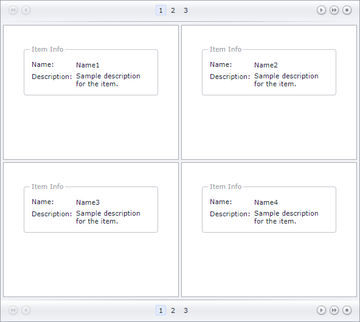

<!-- default badges list -->

<!-- default badges end -->
# Data View for ASP.NET Web Forms - How to bind the control to a data source at runtime
<!-- run online -->
**[[Run Online]](https://codecentral.devexpress.com/t358210/)**
<!-- run online end -->
This example demonstrates how to bind the [Data View](https://docs.devexpress.com/AspNet/8280/components/data-and-image-navigation/dataview?p=netframework) control to a data source at runtime. When the control is loaded, the [Load](https://learn.microsoft.com/en-us/dotnet/api/system.web.ui.control.load?view=netframework-4.8.1) event's handler creates a data source, defines a template for data items, and binds the control to the data source.

At runtime, assign an object that implements the [IEnumerable](https://learn.microsoft.com/en-us/dotnet/api/system.collections.ienumerable?view=net-8.0) interface to the [DataSource](https://docs.devexpress.com/AspNet/DevExpress.Web.ASPxDataWebControlBase.DataSource) property and call the [DataBind](https://docs.devexpress.com/AspNet/DevExpress.Web.ASPxWebControl.DataBind) method to bind the `ASPxDataView` control to this object.

## Files to Review

* [MyDataViewTemplate.cs](./CS/App_Code/MyDataViewTemplate.cs) (VB: [MyDataViewTemplate.vb](./VB/App_Code/MyDataViewTemplate.vb))
* [Default.aspx](./CS/Default.aspx) (VB: [Default.aspx](./VB/Default.aspx))
* [Default.aspx.cs](./CS/Default.aspx.cs) (VB: [Default.aspx.vb](./VB/Default.aspx.vb))

## Documentation

- [Bind Data View to Data](https://docs.devexpress.com/AspNet/115695/components/data-and-image-navigation/dataview/concepts/binding-to-data)
- 
